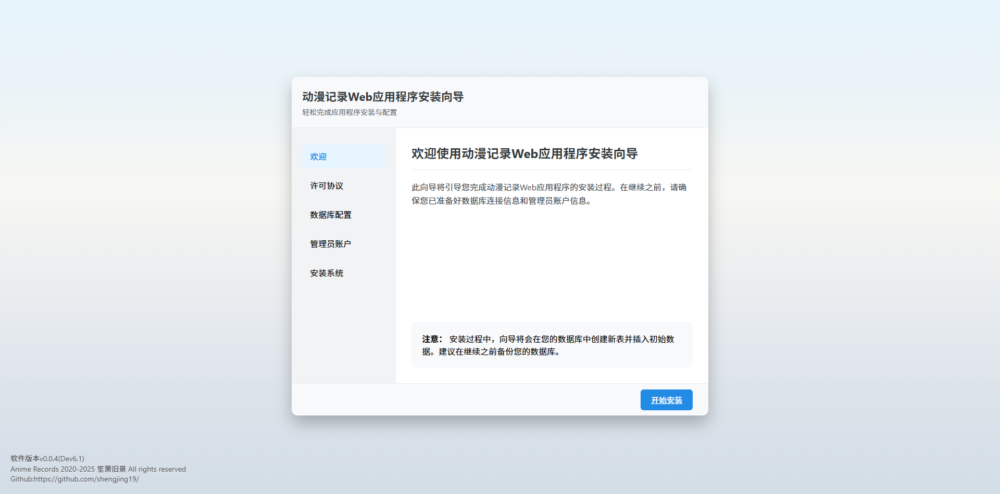
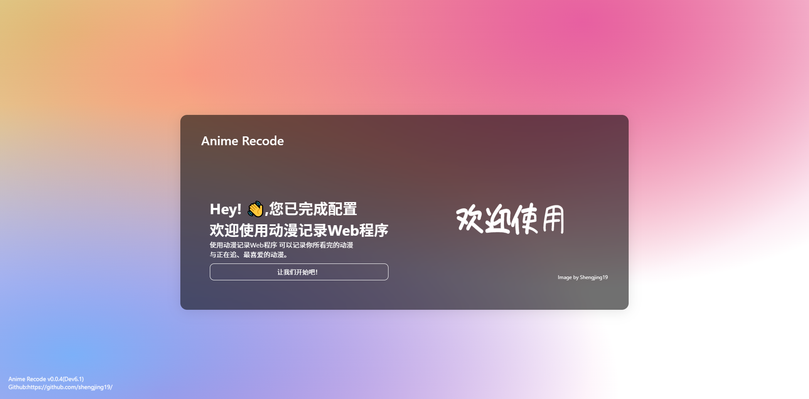
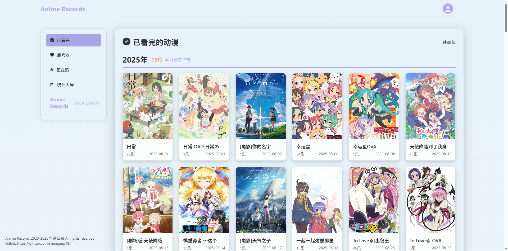
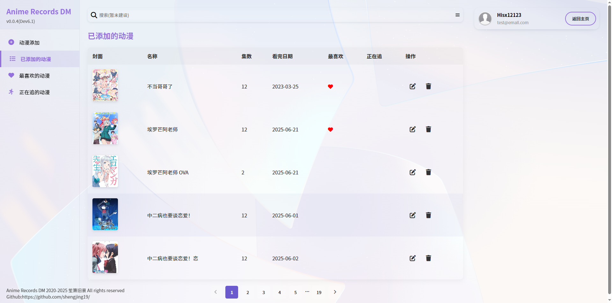
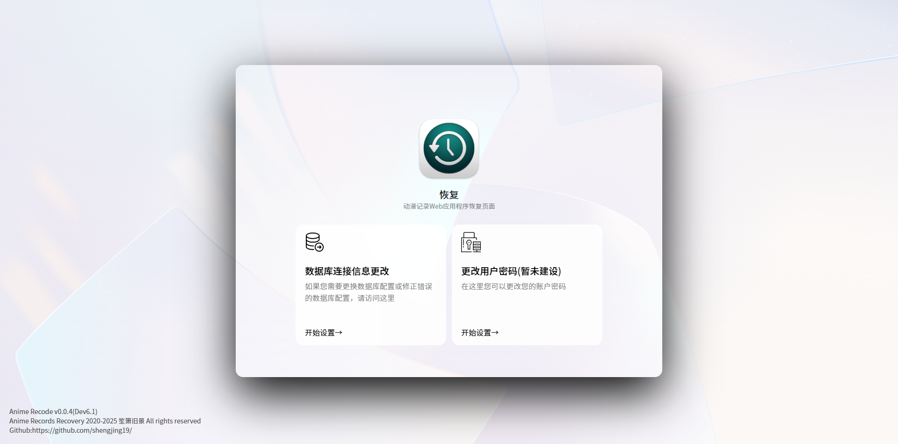

<p align="center">
  
</p>
<p align="center">limange</p>

<p align="center">
  <a href="#"></a>
  <a href="https://github.com/shengjing19/limange/releases"></a>
  <a href="https://github.com/shengjing19/limange/blob/master/LICENSE"></a>
</p>


简介
---

本软件研发目的是为了记录所看完的动漫

> 当前为开发版本，部分功能还没有完善，但主要功能已经完善且正常运行

功能与亮点
---
* 提供初始安装页面，可以进行初始化数据库与登录密码
* 提供恢复页面，当您需要更改数据库地址时，无需进行重新编译即可更改
* 本Web程序为单用户程序，您只需要输入密码即可登录而无需输入用户名
* 动漫展示顺序以时间降序排序，并在每月后面给出本月观看的总部数

使用技术
---

|前端|
|:--|
|HTML+CSS+JS|

|后端|
|:-|
|tomcat+servlet|

|数据库|
|:-|
|Mysql|

## 目录结构

```
.
└── limange/
    ├── .idea
    ├── src
        └── com
            └── AnimeRecode
                └── dao
                └── model
                └── Server
                └── servlet
            └── AnimeRecodeConfig
            └── AnimeRecodeSecurity
                └── session
                └── upload
            └── google
  ├── web
      └── css
      └── fontawesome6.4.0
      └── img
      └── js
      └── WEB-INF
      └── admin.jsp
      └── index.jsp
      └── install.jsp
      └── login.jsp
      └── noaccess.html
      └── recovery.jsp
```

下载
---

* [下载软件最新版已编译版本](https://github.com/shengjing19/limange/releases) 

提示：需要JDK-23版本 推荐tomcat 9.0.91及以上版本

---
> install.jsp

> login.jsp 欢迎部分

> login.jsp 登录部分

> index.jsp

> admin.jsp

> recovery.jsp


---

一些提示
---

> 1.前端UI界面仅支持电脑端，移动端未进行前端适配
>
> 2.暂没有提供注册也没有做针对某个用户进行sql查询动漫信息(后续可能会做这个分支)，目前是单用户
>
> 3.前端交互与接口调用依赖于js，使用AJAX进行前后端分离，除部分页面逻辑需要Java控制外，其余主要数据获取与修改均已前后端分离(install.jsp除外，install.jsp完全独立)

编译以及生成
---

| 支持的编译工具：||
|:-|:-:|
| [IntelliJ IDEA] 2024.1.7 | (推荐) |
| MyEclipse (目录结构不一样，需要自己配置) | (不推荐) |

|JDK||
|:--|:-:|
|[JDK14]或以上||

构建步骤：
1. 重命名下载的项目文件夹名称(只保留limange)，使用idea打开项目文件夹
2. 在顶部工具栏选择文件，弹出的菜单选择项目结构。
3. 调整工件的输出目录为您当前tomcat的webapps目录下，文件夹名称应与项目名(limange)一致
4. 在顶部工具栏选择运行，弹出的菜单选择编辑配置。
5. 配置应用程序服务器，为你实际tomcat
6. 修改端口为你tomcat的实际端口

使用的第三方库
---

*第三方库已经包含在项目中，不需要您自己安装*

- [Gson](https://github.com/google/gson)

许可
---

[GPL-3.0 License](https://github.com/shengjing19/limange/blob/master/LICENSE) 

